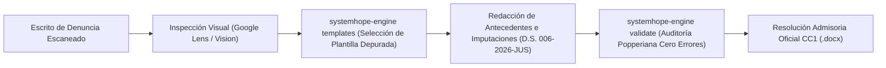

# SystemHope ResAdmis - Sistema Autónomo de Resoluciones Admisorias INDECOPI CC1

> **Plataforma Integral de Generación, Calibración Visual y Validación Popperiana de Resoluciones Admisorias de Seguros y Servicios Financieros.**  
> Diseñado para operar con **Antigravity IDE**, **Cursor**, **Windsurf**, **Claude Code** y cualquier entorno de IA Desktop, con memoria persistente y versionada en GitHub.

[](https://github.com/zero-phoenix/SystemHope-ResAdmis)
[](docs/MATRIZ_MAESTRA_PHOENYX_POPPERIANA.md)
[-red)](AGENTS.md)
[](docs/INDICE_TAXONOMICO_PLANTILLAS_MAESTRAS.md)

---

## 🏛️ Arquitectura y Filosofía del Sistema

Este repositorio alberga la memoria completa, reglas normativas, parámetros visuales y 605 plantillas Word (`.docx`) depuradas para la elaboración de Resoluciones Admisorias en la Comisión de Protección al Consumidor N° 1 (CC1) del Indecopi.

### 🌐 Persistencia de Memoria en el Repositorio (Zero-Local-Loss)
**El repositorio es el cerebro:** Ninguna directriz crítica reside únicamente de manera local. Si esta computadora es formateada o si otro agente/desarrollador clona este repositorio en cualquier parte del mundo:
1. Clona o descarga el ejecutable desde [Releases](https://github.com/zero-phoenix/SystemHope-ResAdmis/releases).
2. Ejecuta `./systemhope-engine.exe dump-memory` o arranca el servidor MCP `./systemhope-engine.exe mcp`.
3. El entorno de IA adquiere instantáneamente el 100% de la doctrina institucional, catálogo taxonómico y reglas popperianas.

---

## 🛑 Axiomas y Prohibiciones Críticas (Doctrina CC1)

### 1. Mandato Estricto Cero-OCR (Solo Google Lens / Visión Multimodal)
- **PROHIBIDO EL USO DE OCR:** Los expedientes administrativos de consumo contienen escritos escaneados y firmas donde el OCR clásico fragmenta párrafos, pierde tablas y alucina números de póliza o fechas críticas.
- **ANÁLISIS OBLIGATORIO:** Las denuncias y escritos complementarios deben inspeccionarse **únicamente mediante Google Lens o modelos de visión multimodal**.

### 2. Normativa TUO LPAG Vigente
- Todas las referencias normativas al Texto Único Ordenado de la Ley N° 27444 citan estrictamente el **Decreto Supremo N° 006-2026-JUS**.
- **PROHIBIDA** cualquier cita al derogado Decreto Supremo N° 004-2019-JUS.

### 3. Prohibición Absoluta de Imputar por "Inducción a Error"
- **PROHIBIDO** imputar bajo la figura de *inducción al error* o por el Artículo 3° del Código (Ley 29571).
- Toda falta o afectación al deber de información en contratación de seguros se imputa indefectiblemente bajo el **Artículo 1°, numeral 1, literal b) y Artículo 2° del Código**.

### 4. Tiempos Verbales y Narrativa
- **En Antecedentes / Hechos:** Pasado indicativo afirmativo ("solicitó", "adquirió", "presentó"). Prohibido usar "denunciante" en el cuerpo fáctico.
- **En Imputación de Cargos:** Condicional estricto ("habría denegado", "habría omitido", "no habría emitido").

### 5. Invariantes Léxicas y Formato Monetario Monolítico
- `cónyuge` / `cónyuges` (PROHIBIDO: esposo/a).
- `luego de` (PROHIBIDO: tras).
- `esta` / `este` (sin tilde diacrítica).
- `médico` (PROHIBIDO: doctor/a o Dr. para profesionales de salud).
- `vehículo con Placa de Rodaje [N°]` (PROHIBIDO: carro, auto).
- **Moneda:** Únicamente `S/ X XXX,XX` o `US$ X XXX,XX` (espacio para separar miles, coma para decimales; nunca puntos).

---

## 📂 Catálogo Taxonómico de 605 Plantillas Word (`plantillas_maestras/`)

Las 605 resoluciones modelo han sido depuradas ortográficamente, actualizadas a la LPAG 2026 y estructuradas en:
`plantillas_maestras/<RAMA>/<MATERIA>/<PROVEEDOR>/<SUJETO>/TPL_*.docx`

| Directorio | Ramas de Seguro | Plantillas | Materias Clave |
| :--- | :--- | :---: | :--- |
| `01_seguro_vehicular` | Seguro Vehicular y Pérdida Total | **174** | Negativa de cobertura, cláusula abusiva, demora |
| `02_seguro_vida` | Seguro de Vida y Sobrevivencia | **134** | Negativa de cobertura, anulación indebida |
| `03_seguro_desgravamen` | Seguro de Desgravamen Hipotecario/Personal | **66** | Negativa de siniestro, falta de póliza |
| `04_seguro_proteccion_tarjetas_y_dinero` | Tarjetas, Fraude y Cuentas Bancarias | **37** | Consumos no reconocidos, transferencias no autorizadas |
| `05_soat_y_afocat` | SOAT y Fondos Contra Accidentes de Tránsito | **43** | Negativa de cobertura médica, incapacidad temporal |
| `06_seguro_hogar_e_inmuebles` | Seguros Patrimoniales de Vivienda e Inmuebles | **20** | Daños por agua, sismo, robo |
| `07_seguro_sctr` | Seguro Complementario de Trabajo de Riesgo | **18** | Evaluación de invalidez, pensión de sobrevivencia |
| `08_seguro_salud_eps_oncologico` | EPS, Seguros de Salud y Oncológicos | **12** | Cobertura integral, tratamientos de alto costo |
| `09_seguro_patrimonial_caucion_rc` | Fianzas, Caución y Responsabilidad Civil | **10** | Ejecución de póliza de caución |
| `10_seguro_sepelio` | Seguros Funerarios y de Sepelio | **8** | Reembolso de gastos, cobro indebido |
| `11_seguro_accidentes_personales` | Accidentes Personales | **7** | Indemnización por fallecimiento / desmembración |
| `12_seguro_transporte_y_carga` | Transporte y Carga Terrestre/Marítima | **6** | Pérdida de mercadería en tránsito |
| `13_seguro_multiple_y_equipos` | Equipos Electrónicos y Multirriesgo | **4** | Rotura de maquinaria, equipos móviles |
| `14_seguro_desempleo` | Protección de Cuotas por Desempleo | **2** | Negativa injustificada de cobertura de cuotas |
| `15_sistema_previsional_afp_onp` | Devolución y Trámites Previsionales | **2** | Cobro indebido de primas previsionales |
| `16_temas_administrativos_financieros` | Procesos Financieros Conexos | **4** | Información errónea en centrales de riesgo |
| `17_seguro_no_especificado` | Pólizas No Categorizadas | **58** | Materias diversas |
| **TOTAL** | **18 Ramas de Seguro** | **605** | **100% Depuradas y Verificadas** |

---

## 📐 Parámetros de Diseño y Estilo Visual CC1

Documentados exhaustivamente en [docs/MEMORIA_ESTILO_VISUAL_PAGINAS.md](docs/MEMORIA_ESTILO_VISUAL_PAGINAS.md):
- **Tipografía Institucional:** `Arial Narrow` (11 pt para el cuerpo de resolución, 8 pt para notas al pie, encabezados y pies de página).
- **Márgenes de Página (A4):**
  - Superior: `2.5 cm` (0.98")
  - Inferior: `2.5 cm` (0.98")
  - Izquierdo: `3.0 cm` (1.18")
  - Derecho: `2.5 cm` (0.98")
- **Interlineado y Espaciado:** Interlineado sencillo (1.0). Espaciado anterior y posterior: `0 pt`.
- **Sangrías Escalonadas CC1:**
  - Párrafos de Hechos: Sangría izquierda `0.79"` (2.0 cm), Sangría francesa `-0.39"` (-1.0 cm).
  - Puntos Resolutivos: Sangría izquierda `0.39"` (1.0 cm), Sangría francesa `-0.39"` (-1.0 cm).
  - Bloque de Metadatos: Sangría izquierda `1.48"` (3.75 cm), Sangría francesa `-1.48"` (-3.75 cm).
- **Notas al Pie Institucionales:** Empleo de *One Dot Leader* (`\u2024`) antes del texto para suprimir la sangría nativa de Word. Pie de página: `M-CPC-01/03`.

---

## ⚡ Motor Autónomo (`systemhope-engine.exe`)

El repositorio compila automáticamente en **GitHub Actions** un ejecutable independiente para Windows (`systemhope-engine.exe`) publicado en cada [GitHub Release](https://github.com/zero-phoenix/SystemHope-ResAdmis/releases).

### Comandos Principales de la CLI:
```powershell
# 1. Ver estado del sistema, normativas y catálogo:
./systemhope-engine.exe info

# 2. Consultar reglas popperianas y prohibiciones:
./systemhope-engine.exe rules

# 3. Consultar especificaciones de diseño y medidas:
./systemhope-engine.exe specs

# 4. Buscar plantillas por rama, materia, ddo o sujeto:
./systemhope-engine.exe templates --rama vehicular --materia negativa_cobertura
./systemhope-engine.exe templates --rama 03_seguro_desgravamen --limit 5

# 5. Auditar un documento Word contra las 95 reglas:
./systemhope-engine.exe validate "C:\Ruta\Mi_Resolucion.docx"

# 6. Exportar memoria completa (AGENTS.md, .cursorrules, CLAUDE.md) a cualquier proyecto:
./systemhope-engine.exe dump-memory --dir .

# 7. Iniciar Servidor MCP (Model Context Protocol) sobre stdio:
./systemhope-engine.exe mcp
```

---

## 🤖 Integración con AI IDEs Desktop (Antigravity, Cursor, Windsurf, Claude)

### Opción A: A través de Memoria Versionada (Archivos de Directivas)
El repositorio ya incluye en la raíz:
- [AGENTS.md](AGENTS.md): Directivas maestras para Antigravity IDE, Windsurf y Copilot.
- [.cursorrules](.cursorrules): Instrucciones automáticas para Cursor IDE.
- [CLAUDE.md](CLAUDE.md): Instrucciones de comando para Claude Code y Claude Desktop.

### Opción B: Integración como MCP Server (Model Context Protocol)
Agrega el motor ejecutable en el archivo de configuración de tu AI IDE (ej. `claude_desktop_config.json` o en la configuración MCP de Cursor/Antigravity):
```json
{
  "mcpServers": {
    "systemhope-resadmis": {
      "command": "C:\\Ruta\\systemhope-engine.exe",
      "args": ["mcp"]
    }
  }
}
```
Esto dotará a tu IA de herramientas nativas para consultar reglas, buscar plantillas en tiempo real y auditar documentos sin salir del entorno.

---

## 🔄 Flujo de Trabajo para Nuevas Resoluciones Admisorias



---

## 👥 Créditos y Licencia
- **Desarrollado para:** Indecopi - Comisión de Protección al Consumidor N° 1 (CC1).
- **Repositorio:** [zero-phoenix/SystemHope-ResAdmis](https://github.com/zero-phoenix/SystemHope-ResAdmis)
- **Licencia:** MIT.
