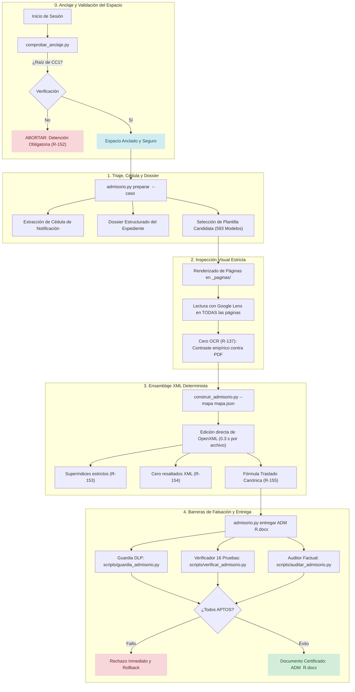
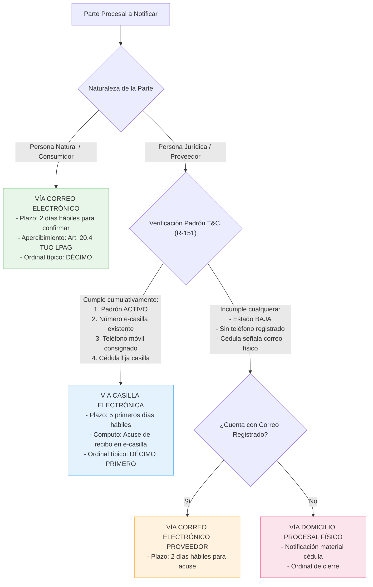
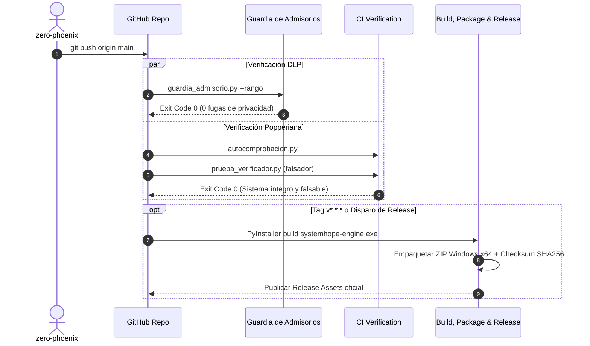

# SystemHope ResAdmis — CC1 (v2.3.1)

Sistema autónomo y determinista de redacción jurídica, calibración micro-tipográfica, auditoría factual y falsación popperiana de **resoluciones admisorias** para la Secretaría Técnica de la Comisión de Protección al Consumidor N° 1 (CC1) del Indecopi.

```
       _____           _                 _    _                   
      / ____|         | |               | |  | |                  
     | (___  _   _ ___| |_ ___ _ __ ___ | |__| | ___  _ __   ___  
      \___ \| | | / __| __/ _ \ '_ ` _ \|  __  |/ _ \| '_ \ / _ \ 
      ____) | |_| \__ \ ||  __/ | | | | | |  | | (_) | |_) |  __/ 
     |_____/ \__, |___/\__\___|_| |_| |_|_|  |_|\___/| .__/ \___| 
              __/ |                                  | |          
             |___/                                   |_|          
                R E S A D M I S   —   C C 1   ( v 2 . 3 . 1 )
```

---

## 🏛️ Marco Jurídico e Institucional

* **Órgano Resolutivo:** Secretaría Técnica de la Comisión de Protección al Consumidor N° 1 (CC1) — Sede Central Indecopi.
* **Ley Sustantiva:** Ley N° 29571 — Código de Protección y Defensa del Consumidor (artículos 1°, 2°, 18°, 19°, 56°, 110°, 114°, 115°, 116°).
* **Ley de Organización y Funciones:** Decreto Legislativo N° 1033 (artículo 27°).
* **Ley de Facultades, Normas y Organización:** Decreto Legislativo N° 807 (artículos 26°, 29°, 39°).
* **Ley Adjetiva y Procedimiento Administrativo General:** Texto Único Ordenado de la Ley N° 27444 — Ley del Procedimiento Administrativo General, aprobado mediante Decreto Supremo N° 006-2026-JUS (artículos 20°, 223°).
* **Sujeto Firmante Único:** Luisa Analí Silva Malpartida — Secretaria Técnica (e) de la CC1 (R-103).

---

## 🔬 Paradigma Epistemológico: Falsacionismo Popperiano

Este sistema no opera mediante validación probabilística ni confirmación inductiva de lenguaje natural. Se fundamenta estrictamente en la **epistemología falsacionista de Karl Popper** (*Logik der Forschung*, 1934):

> *«Una teoría sólo es científica si es falsable; y un acto administrativo sólo es válido si supera todos los intentos empíricos y normativos diseñados para refutarlo.»*

En `SystemHope-ResAdmis`, cada regla técnica o jurídica es un **falsador negativo**: un control automatizado concebido exclusivamente para hacer **fallar** el documento si detecta la menor desviación tipográfica, ortográfica, léxica, de personería o de correlato procesal.

### La Escala Empírica de Arbitraje

Para dirimir cualquier discrepancia entre estilo, opiniones de agentes y directrices, el sistema aplica una regla de frecuencias sobre el corpus histórico de **593 plantillas maestras**:

| Frecuencia en Corpus (N=593) | Clasificación Epistemológica | Acción del Sistema |
|:---|:---|:---|
| **0 de 593** | **Prohibición Absoluta** | Vetado y sancionado como fallo crítico. Se corrige de oficio. |
| **1 de 593** | **Desviación Cuasi-Absoluta** | Anomalía histórica aislada. Se rechaza y se reconduce a la norma. |
| **≥ 5 de 593** | **Variante de Estilo** | No constituye prohibición. Se respeta y no se fuerza. |
| **Mandato Expreso del Instructor** | **Precepto Vinculante** | Prevalece sobre la media estadística y se codifica como regla obligatoria. |

---

## 🔄 Arquitectura y Ciclo Operativo End-to-End

El ciclo de vida de un admisorio abarca desde la ingesta del expediente crudo hasta la emisión del archivo `.docx` certificado, sin intervención de Microsoft Word ni dependencias COM.



---

## 🛡️ Las Cuatro Barreras de Seguridad y Calidad

Ninguna barrera reemplaza a las demás; operan como círculos concéntricos de defensa:

```mermaid
flowchart LR
    Doc["Documento .docx"] --> B1["Barrera 1: Guardia DLP\n(scripts/guardia_admisorio.py)"]
    B1 -->|Limpio de datos personales| B2["Barrera 2: Verificador Popperiano\n(scripts/verificar_admisorio.py)"]
    B2 -->|Cumple 16 Reglas Técnicas| B3["Barrera 3: Auditor Ontológico\n(scripts/auditar_admisorio.py)"]
    B3 -->|Cotejo factual 100% Cédula| B4["Barrera 4: Autocomprobación CI\n(scripts/autocomprobacion.py)"]
    B4 -->|Aprobación unánime| Out["EMISIÓN APTA"]

    style Doc fill:#e2e3e5,stroke:#d6d8db
    style B1 fill:#fff3cd,stroke:#ffeeba
    style B2 fill:#cce5ff,stroke:#b8daff
    style B3 fill:#d1ecf1,stroke:#bee5eb
    style B4 fill:#e2d9f3,stroke:#d6c7f7
    style Out fill:#d4edda,stroke:#c3e6cb,color:#155724
```



### Tabla de Responsabilidades de las Barreras

| Barrera | Ámbito de Inspección | Qué Detecta | Lo que NO Puede Detectar |
|:---|:---|:---|:---|
| **1. Guardia de Puerta y DLP** (`guardia_admisorio.py`) | Privacidad y Datos Personales | DNI sueltos (8 dígitos), correos particulares (`@gmail`, `@hotmail`), rutas prohibidas (`casos/`), imágenes sin sello de procedencia Lens. | Coherencia jurídica del texto. |
| **2. Verificador de 16 Pruebas** (`verificar_admisorio.py`) | Estructura micro-tipográfica y procesal | Márgenes (3.0 cm der), firma institucional, negritas, superíndices de notas al pie, ordinales romanos/arábigos, prohibición de resaltados, fórmula R-155. | Si los datos del denunciante coinciden con el expediente. |
| **3. Auditor Factual** (`auditar_admisorio.py`) | Correspondencia Ontológica | Que cada nombre, placa, fecha, póliza y ordinal conste fehacientemente en la Cédula y en los actuados del expediente. | La estética o micro-espaciado XML. |
| **4. Autocomprobación** (`autocomprobacion.py`) | Integridad del Repositorio y CI | Expresiones regulares sin caracteres de retroceso (`\x08`), ausencia de volcados temporales rastreados, compilación limpia de scripts. | El contenido semántico de un caso nuevo. |

---

## 📑 Anatomía Canónica del Acto Administrativo Resolutivo

Toda resolución admisoria de la CC1 responde al siguiente estándar estructural, verificado estadísticamente sobre 566 admisorios del corpus:

```mermaid
graph TD
    subgraph Encabezado["ENCABEZADO INSTITUCIONAL"]
        H1["Isotipo y Membrete Indecopi CC1 (R-107)"]
        H2["Ficha Técnica: EXPEDIENTE · DENUNCIANTE · DENUNCIADO · MATERIAS · RESOLUCIÓN N°"]
    end

    subgraph Antecedentes["I. ANTECEDENTES Y HECHOS"]
        A1["Párrafo introductorio de presentación de denuncia y subsanación"]
        A2["Relación cronológica de hechos denunciados: (i), (ii), (iii)..."]
        A3["Modo verbal pretérito e imparcial (R-110)"]
    end

    subgraph Considerativa["II. PARTE CONSIDERATIVA (ANÁLISIS)"]
        C1["Competencia de la Secretaría Técnica (art. 105 Código, art. 27 DL 1033)"]
        C2["Subsunción típica: Idoneidad (arts. 18-19), Información (art. 2), Coercitivos (art. 56)"]
        C3["Calificación de Medidas Correctivas pretendidas"]
        C4["Requerimientos de Información probatoria al proveedor"]
    end

    subgraph Resolutiva["III. PARTE RESOLUTIVA (ORDINALES CANÓNICOS)"]
        R1["PRIMERO: Admitir a trámite + Imputación de cargos verbatim (R-97)"]
        R2["SEGUNDO: Tener por ofrecidos los medios probatorios"]
        R3["TERCERO: Acreditación de personería, RUC, domicilio procesal y condición MYPE"]
        R4["CUARTO: Correr traslado y descargos (5 días hábiles, rebeldía, art. 223 LPAG) (R-155)"]
        R5["QUINTO: Requerimiento probatorio de póliza, siniestro o comunicaciones"]
        R6["SEXTO: Apercibimiento de sanción hasta 450 UIT (art. 110 Código)"]
        R7["SÉTIMO: Costas, costos y gastos de peritaje (art. 39 DL 807)"]
        R8["OCTAVO: Facultad de conciliar y poder especial de representación (art. 29 DL 807)"]
        R9["NOVENO: Reserva y confidencialidad de secretos comerciales (opcional)"]
        R10["DÉCIMO: Notificación por vía de correo electrónico (2 días hábiles)"]
        R11["DÉCIMO PRIMERO: Notificación por Casilla Electrónica si cumple R-151 (5 días hábiles)"]
        R12["DÉCIMO SEGUNDO: Notificación por domicilio procesal físico (2 días hábiles)"]
    end

    subgraph PieFirma["PIE Y FIRMA"]
        F1["Firma: LUISA ANALI SILVA MALPARTIDA\nSecretaria Técnica (e) (R-103)"]
    end

    Encabezado --> Antecedentes
    Antecedentes --> Considerativa
    Considerativa -->|Isomorfismo Verbatim R-97| Resolutiva
    Resolutiva --> PieFirma

    style Encabezado fill:#f8f9fa,stroke:#dee2e6
    style Antecedentes fill:#f1f3f5,stroke:#ced4da
    style Considerativa fill:#e9ecef,stroke:#adb5bd
    style Resolutiva fill:#dee2e6,stroke:#6c757d
    style PieFirma fill:#e3fafc,stroke:#99e9f2
```



---

## 📬 Régimen Canónico de Notificaciones (R-129 y R-151)

> **Regla Cardinal:** La resolución formula **un ordinal por vía de notificación**, jamás un ordinal por parte procesal.

* Dos partes que comparten la misma vía van agrupadas en un único ordinal en plural.
* Dos partes con vías distintas exigen dos ordinales resolutivos separados.
* Jamás se fusionan vías distintas con enlaces tipo `; y,` en un solo ordinal (0 apariciones en 1 087 párrafos analizados).

### Árbol de Decisión de Canales de Notificación



### Proveedores Clave y Estado de Casilla en CC1

* **Sin Casilla Electrónica Habilitada (Notificación por Correo / Domicilio):**
  * **Rímac Seguros y Reaseguros S.A.** (De baja en padrón; 137 de 137 casos notificados por correo/físico).
  * **Banco de Crédito del Perú - BCP** (Sin teléfono válido; 28 de 29 casos por correo).
  * **Banco Ripley S.A.** (Sin requisitos; 2 de 2 casos por correo).
  * **Banco Pichincha**, **Financiera Proempresa**, **Fovipol**, **AFOCAT**.
* **Con Casilla Electrónica Habilitada:**
  * **La Positiva Seguros y Reaseguros S.A.A.** (Padrón activo con teléfono y número e-casilla).
  * **Mapfre Perú Compañía de Seguros y Reaseguros S.A.** (Padrón activo con requisitos completos).
  * **Pacífico Compañía de Seguros y Reaseguros** (Padrón activo).

---

## ⚖️ Matriz de las 16 Reglas de Falsación (R-97 a R-155)

Cada regla ejecutada en `scripts/verificar_admisorio.py` posee un criterio de demarcación estricto:

| Código | Regla Evaluada | Criterio de Falsación Empírica | Frecuencia de Control |
|:---|:---|:---|:---|
| **R-97** | Isomorfismo Considerativa / Resolutiva | Falla si el texto del hecho imputado difiere entre la sección II y el ordinal PRIMERO. | 86.5 % verbatim en corpus |
| **R-103** | Firma Institucional Canónica | Falla si la firma no es `LUISA ANALI SILVA MALPARTIDA` como `SECRETARIA TECNICA (E)` o si figura Eveling Roa Quispe. | Mandato vinculante (100 %) |
| **R-104** | Negritas de Ordinales y Encabezado | Falla si los ordinales no inician en negrita o el encabezado omite el formato canónico. | 100 % en corpus |
| **R-105** | Párrafos Numerados Vacíos | Falla si existen etiquetas `<w:p>` numeradas sin contenido de texto en el XML. | 0 tolerado |
| **R-106** | Anclas de Nota al Pie Pareadas | Falla si una llamada de nota al pie no tiene su cuerpo en `footnotes.xml` o viceversa. | 100 % pareado |
| **R-107** | Membrete y Pie Institucional | Falla si falta el encabezado oficial de Indecopi CC1 en las secciones del documento. | 100 % en corpus |
| **R-108** | Espejo del Requerimiento | Reporta divergencia entre la considerativa y el ordinal QUINTO de información. | Observación estadística |
| **R-110** | Modo Verbal en Hechos | Falla si los hechos no usan pretérito/condicional objetivo (`habría`, `solicitó`, `denunció`). | Falsador gramatical |
| **R-143** | Imputaciones del Catálogo | Falla si la calificación jurídica no corresponde a una de las 64 fórmulas de `catalogo_imputaciones.json`. | 64 combinaciones cerradas |
| **R-144** | Fuente, Interlineado y Encuadre | Falla si el margen derecho difiere de 3.0 cm, fuente no es Arial 10 pt o interlineado != 1.15. | 113 de 116 secciones |
| **R-146** | Ortografía de Ordinales | Falla si se detecta `UNDÉCIMO` o `DUODÉCIMO` (debe ser `DÉCIMO PRIMERO` y `DÉCIMO SEGUNDO`). | 0 de 593 en corpus |
| **R-148** | Léxico Invariante | Falla si se citan decretos o leyes derogadas o con denominaciones informales no canónicas. | Falsador léxico |
| **R-151** | Casilla Electrónica Habilitada | Falla si se notifica por casilla a un proveedor que carece de teléfono, está de baja o no tiene número de e-casilla. | Padrón T&C depurado |
| **R-153** | Superíndice Estricto en Notas | Falla si alguna llamada en texto no lleva `w:vertAlign w:val="superscript"` o la nota al pie no tiene estilo `Refdenotaalpie` a 8 pt. | 100 % estricto |
| **R-154** | Cero Resaltados en el Documento | Falla si existe al menos una etiqueta `<w:highlight>` en todo el paquete XML del documento `.docx`. | 0 de 593 en corpus |
| **R-155** | Fórmula Canónica de Traslado | Falla si el párrafo de traslado no contiene el apercibimiento de rebeldía y la cita al art. 223° del TUO de la LPAG. | Mandato vinculante 2026 |

---

## 📐 Especificaciones Micro-Tipográficas y OpenXML

Los documentos generados cumplen con un estándar de micro-diseño tipográfico verificado directamente en el árbol XML:

```
┌────────────────────────────────────────────────────────────────────────┐
│ Margen Superior: 2.5 cm                                               │
│                                                                        │
│ Margen Izquierdo: 3.0 cm                      Margen Derecho: 3.0 cm  │
│                                                                        │
│ CUERPO DEL TEXTO:                                                      │
│ - Tipografía: Arial 10 pt regular.                                     │
│ - Alineación: Justificada estricta (w:jc w:val="both").                │
│ - Interlineado: Múltiple en 1.15 líneas (w:line="276" w:lineRule="auto")│
│ - Espaciado entre párrafos: 0 pt posterior (w:after="0").              │
│                                                                        │
│ NOTAS AL PIE (FOOTNOTES):                                              │
│ - Tipografía: Arial 8 pt regular.                                      │
│ - Estilo de llamada: Refdenotaalpie con vertAlign="superscript".       │
│ - Separador: Línea horizontal normalizada de Word.                     │
│                                                                        │
│ HIGHLIGHTS: Prohibición absoluta de <w:highlight>. Cero marcas de color│
│ Margen Inferior: 2.5 cm                                               │
└────────────────────────────────────────────────────────────────────────┘
```

---

## 🛠️ Catálogo Completo de Herramientas CLI (25 Scripts)

El ecosistema de scripts en `scripts/` se divide por especialidad técnica:

### 1. Orquestación y Flujo de Trabajo
* `python scripts/comprobar_anclaje.py`: Verifica que la sesión de Antigravity esté anclada exactamente a la raíz del repositorio. Detiene la ejecución si detecta un workspace desviado (R-152).
* `python scripts/admisorio.py preparar <carpeta> --caso <exp>`: Extrae la cédula, genera el dossier anclado y filtra las plantillas más afines.
* `python scripts/admisorio.py entregar "<ruta.docx>" --caso <exp>`: Ejecuta en una sola llamada el Verificador de 16 Pruebas, la Guardia DLP y el Auditor Factual.
* `python scripts/orquestar.py`: Monitoriza agentes en paralelo, administra estados de conversación y aplica directivas en caliente.
* `python scripts/vigilar.py` / `vigilar_remesa.py`: Centinelas de procesos huérfanos de Word y monitores de carpetas de remesa activa.

### 2. Verificación, Auditoría y Calidad
* `python scripts/verificar_admisorio.py <doc.docx>`: Falsador automático principal de 16 pruebas. Emite veredicto determinista `APTO` o `NO APTO`.
* `python scripts/auditar_admisorio.py <doc.docx> --cedula <cedula.txt>`: Audita que no existan fechas, nombres, placas ni pretensiones no respaldadas por el expediente.
* `python scripts/prueba_verificador.py`: Test unitario de falsabilidad. Construye un documento dañado a propósito y verifica que el verificador lo rechace obligatoriamente.
* `python scripts/autocomprobacion.py`: Comprobación interna de salud del código (cero retrocesos regex, cero datos personales, compilación íntegra).

### 3. Normalización y Calibración en Masa
* `python scripts/normalizar_plantillas_popperianas.py`: Aplica la calibración micro-tipográfica a las 593 plantillas (márgenes a 3.0 cm, superíndices R-153 y eliminación de resaltados R-154).
* `python scripts/aplicar_traslado_r155.py`: Actualiza el párrafo de traslado y descargos de todo el repositorio con la fórmula obligatoria R-155.
* `python scripts/armonizar_formato.py`: Alinea estilos y fuentes XML en lote.
* `python scripts/anonimizar_plantillas.py`: Aplica filtros DLP a nivel de run XML para proteger el repositorio público.

### 4. Seguridad, Padrón y Análisis Visual
* `python scripts/guardia_admisorio.py [--staged | --rango A..B | archivos]`: Guardia de puerta contra fugas de privacidad (DNI, correos, expedientes de trabajo).
* `python scripts/filtrar_casillas.py <Reporte.xlsx>`: Procesa el padrón masivo de T&C de Indecopi y genera el dictamen estructurado en `docs/casillas_habilitadas.json`.
* `python scripts/capturar_referencias.py`: Genera capturas renderizadas de páginas de expedientes, aplicando sellos criptográficos de procedencia Lens (R-150).
* `python scripts/catalogar_imputaciones.py`: Analiza las frecuencias de infracciones en el corpus y actualiza el árbol de tipos infractores.

---

## 📂 Taxonomía del Corpus (593 Plantillas Maestras)

Las 593 plantillas maestras categorizadas en `plantillas_maestras/` y catalogadas en `docs/INDICE_TAXONOMICO_PLANTILLAS_MAESTRAS.md` cubren las siguientes materias del derecho de consumo:

```
plantillas_maestras/
├── 01_SEGUROS_VEHICULARES/          (Rechazos de siniestro, pérdida total, robo, GPS, grúa)
├── 02_SEGUROS_DE_SALUD_Y_VIDA/      (Preexistencias, indemnizaciones por fallecimiento, clínicas)
├── 03_SERVICIOS_FINANCIEROS/        (Operaciones no reconocidas, fraudes, cargos indebidos, créditos)
├── 04_SISTEMA_INMOBILIARIO/         (Retardo en entrega, defectos de construcción, áreas comunes)
├── 05_TRANSPORTE_AEREO_Y_TERRESTRE/ (Cancelaciones, demoras, pérdida de equipaje, sobreventa)
├── 06_COMERCIO_ELECTRONICO_RETAIL/  (Falta de entrega, garantía legal, libro de reclamaciones)
└── 07_EDUCACION_Y_SALUD_PRIVADA/    (Pensiones educativas, certificados, atenciones médicas)
```

---

## 🚀 Integración Continua, Empaquetado y Distribución

El proyecto cuenta con un pipeline de GitHub Actions tripartito y determinista:



### Descarga de Binarios
Los ejecutables autónomos de producción están disponibles en la sección de **[Releases](https://github.com/zero-phoenix/SystemHope-ResAdmis/releases)**:
* `systemhope-engine.exe`: Motor de verificación y construcción de resoluciones (compilado para Windows x64 con PyInstaller).
* `systemhope-engine-windows-x64.zip`: Paquete completo portable con utilitarios y esquemas JSON.

---

## ⚙️ Instalación y Puesta en Marcha Local

### Prerrequisitos
* Python 3.10 o superior instalado en el PATH.
* Git para Windows con Git Credential Manager habilitado.

```bash
# 1. Clonar el repositorio
git clone https://github.com/zero-phoenix/SystemHope-ResAdmis.git
cd SystemHope-ResAdmis

# 2. Instalar dependencias
pip install -r requirements.txt

# 3. Instalar la guardia en los hooks de pre-commit
python scripts/instalar_hooks.py

# 4. Validar el estado del anclaje y autocomprobación
python scripts/comprobar_anclaje.py
python scripts/autocomprobacion.py
```

---

## 📄 Licencia y Gobernanza

Distribuido bajo licencia MIT. Consulte el archivo [`LICENSE`](LICENSE) para mayores detalles.
Para pautas sobre cómo incorporar nuevas reglas o imputaciones al catálogo, revise [`CONTRIBUTING.md`](CONTRIBUTING.md) y [`docs/SUPERVISION_DE_AGENTES.md`](docs/SUPERVISION_DE_AGENTES.md).
