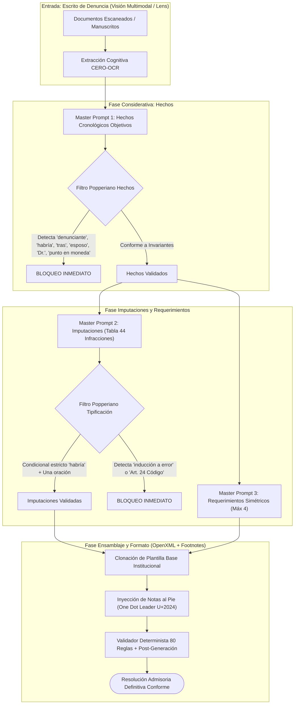

# MATRIZ MAESTRA PHOENYX: ARQUITECTURA POPPERIANA DE RESOLUCIONES ADMISORIAS CC1

**Autoridad:** Secretaría Técnica de la Comisión de Protección al Consumidor 1 (CC1) - INDECOPI (Sede Central, Perú)  
**Marco Temporal del Sistema:** 2026 (Referencia interna de trabajo: 13 de setiembre de 2026, no mencionada en documentos)  
**Corpus de Aprendizaje:** 605 modelos DOCX y 881 PDFs (`C:\\Users\\D\\Desktop\\000 PLAN PHOENYX`)  
**Paradigma de Validación:** Asimetría Falsacionista Popperiana (Invariantes Estructurales vs. Prohibiciones Categóricas)

---

## 1. El Sistema Popperiano: Invariantes (DOs) vs. Prohibiciones (DONTs)

Bajo el rigor falsacionista, una resolución admisoria no se considera jurídicamente válida por la acumulación de frases correctas, sino por su **total invulnerabilidad frente a infracciones procesales, normativas o formales prohibidas**. Basta una sola prohibición violada (ej. imputar el Art. 24 del Código, imputar "inducción a error", un salto manual que desalinee una nota al pie, o usar punto decimal en moneda) para que el documento sea nulo o defectuoso.



### Tabla Popperiana: Lo que SIEMPRE se debe hacer vs. Lo que NUNCA se debe hacer

| Componente | ✅ Lo que SIEMPRE se debe hacer (Invariantes / DOs) | ❌ Lo que NUNCA se debe hacer (Prohibiciones / DONTs) |
| :--- | :--- | :--- |
| **Hechos (Considerativa)** | • Cada párrafo empieza con la fecha: `El [día] de [mes] del [año],`<br>• Si no hay fecha para hecho previo importante: `Con anterioridad a [fecha posterior],`<br>• Tercera persona, pasado afirmativo directo: `presentó`, `solicitó`, `denegó`<br>• Cronología estricta de lo más antiguo a lo más reciente<br>• Cónyuge: `cónyuge` o `cónyuges`<br>• Temporalidad: `luego de`<br>• Primera mención póliza: `Seguro [tipo] – Póliza [número] (en adelante, “Seguro [tipo]”)`<br>• Vehículos: `vehículo con Placa de Rodaje [número]`<br>• Sucesión: `la/el causante de la Sucesión Intestada`<br>• Profesionales de la salud: `médico`<br>• Moneda: `S/ 2 618,00` o `US$ 1 500,00` (coma decimal, espacio en miles) | • **PROHIBIDO** escribir la palabra `denunciante` o el nombre del denunciante dentro de los hechos (va tras *"el/la denunciante señaló lo siguiente:"*)<br>• **PROHIBIDO** usar condicionales como `habría` o `habrían` en hechos<br>• **PROHIBIDO** invocar normas o argumentos de derecho en hechos<br>• **PROHIBIDO** usar la palabra `anexo` de forma aislada<br>• **PROHIBIDO** escribir `esposo`, `esposa` o `esposos`<br>• **PROHIBIDO** usar `tras`<br>• **PROHIBIDO** tildar `esta` (`ésta`, `éstas`, `éste` prohibidos)<br>• **PROHIBIDO** escribir `Dr.` o `doctor/doctora`<br>• **PROHIBIDO** escribir `carro` o `auto`<br>• **PROHIBIDO** usar punto `.` en montos o coma en miles |
| **Imputaciones (Resolutivo PRIMERO)** | • Cada imputación es de **una sola oración**<br>• Iniciar con viñeta correlativa: `(i)`, `(ii)`, etc.<br>• Siempre invocar la fórmula formal completa: `Presunta infracción a... de la Ley 29571...`<br>• Condicional obligatorio: `el proveedor denunciado habría / no habría...`<br>• Si hay >1 denunciado, nombrar al sujeto imputado en cada inciso<br>• Fechas con días exactos y números de póliza/contrato concretos | • **PROHIBIDO IMPUTAR INDUCCIÓN A ERROR** (Bajo ninguna circunstancia invocar "inducción al error" ni el Art. 3 por dicho concepto; usar siempre Art. 1.1.b y Art. 2)<br>• **PROHIBIDO** imputar el Artículo 24 del Código en banca y seguros (usar Art. 88.1)<br>• **PROHIBIDO** aplicar negritas dentro de las oraciones de imputación<br>• **PROHIBIDO** duplicar imputaciones por un mismo hecho (*non bis in idem*) |
| **Requerimientos de Información** | • Redactar en **un solo párrafo** introductorio<br>• Enumerar con viñetas correlativas `(i)`, `(ii)`... (máximo 4 incisos)<br>• Requerimiento principal simétrico a la infracción principal (ej. si la negativa fue injustificada -> requerir acreditar que fue justificada)<br>• Verbos en **infinitivo**: `presentar`, `remitir`, `exhibir`<br>• Cláusula de cierre obligatoria: `presentar todas las comunicaciones cursadas con la parte denunciante en virtud de los hechos materia de denuncia` | • **PROHIBIDO** exceder de cuatro (4) incisos en el párrafo de requerimientos<br>• **PROHIBIDO** usar verbos en subjuntivo (`presente`, `exhiba`)<br>• **PROHIBIDO** usar fórmulas genéricas como "presentar un informe detallado"<br>• **PROHIBIDO** mencionar la frase "deber de información" en los requerimientos fácticos |
| **Notificaciones (Resolutivo DÉCIMO..)** | • Correo electrónico: plazo de dos (2) días hábiles (Art. 20.4 LPAG D.S. 006-2026-JUS)<br>• Casilla electrónica: plazo de cinco (5) días hábiles para acuse de recibo<br>• Domicilio físico: apercibimiento de fijar domicilio procesal y señalar correo en 2 días<br>• **Unificación:** Si denunciante y denunciado van por correo, unificar en un solo artículo con verbos en plural (`reciban`, `sus bandejas`, `efectúen`, `notificarles`) | • **PROHIBIDO** citar el D.S. 004-2019-JUS (derogado en 2026; la norma vigente es D.S. 006-2026-JUS)<br>• **PROHIBIDO** separar en dos artículos resolutivos a sujetos que comparten la misma vía de notificación<br>• **PROHIBIDO** imponer casilla electrónica a empresas que tienen fijado correo en su cédula |
| **Formato e Ingeniería de Documento** | • Clonar plantilla base con encabezado, escudo y pie `M-CPC-01/03`<br>• Arial Narrow 11 pt para cuerpo; 8 pt para notas al pie e iniciales<br>• Interlineado simple (1.0), espacio anterior 0 pt, espacio posterior 0 pt<br>• One Dot Leader (`\u2024`) en listas de notas al pie para neutralizar el autoformato destructivo de Word COM<br>• Sangría francesa metadata: `left=1.48"`, `hanging=-1.48"`<br>• Sangría Hechos: `left=0.79"`, `hanging=-0.39"`<br>• Sangría Resolutivo: `left=0.39"`, `hanging=-0.39"` | • **PROHIBIDO** generar documentos desde cero con `Document()`<br>• **PROHIBIDO** insertar párrafos vacíos entre viñetas o bajo títulos<br>• **PROHIBIDO** usar Arial regular (expande el texto a 7 páginas; el estándar es 6 páginas justas)<br>• **PROHIBIDO** usar OCR plano sobre expedientes escaneados o manuscritos |

---

## 2. La Tabla Maestra de 44 Hechos Infractores y Tipificación

A partir del análisis forense de la tabla institucional oficial provista, se codifican las 44 tipificaciones del Código de Protección y Defensa del Consumidor (Ley N° 29571), con la regla estricta de **cero inducción al error**:

| N° | Hecho Infractor Denunciado | Tipificación Aplicable según el Código | Fórmula Resolutiva Obligatoria |
| :---: | :--- | :--- | :--- |
| **1** | **Atención de reclamos:** falta de atención, demora, atención inadecuada o incompleta. | • Proveedor financiero: **Artículo 88.1**<br>• Proveedor no financiero: **Artículo 24** | Presunta infracción al numeral 88.1 del artículo 88 [o Art. 24 si no es financiero], en tanto [Proveedor] habría brindado una respuesta inadecuada / no habría atendido el reclamo presentado el [fecha]. |
| **2** | **Atención de requerimientos de información:** falta, demora, respuesta incompleta. | **Artículo 1, numeral 1, literal b) y Artículo 2** | Presunta infracción al artículo 1, numeral 1, literal b) y al artículo 2, en tanto [Proveedor] no habría cumplido con atender el requerimiento de información presentado el [fecha]. |
| **3** | **Incumplimiento de la obligación de informar en general.** | **Artículo 1, numeral 1, literal b) y Artículo 2** | Presunta infracción al artículo 1, numeral 1, literal b) y al artículo 2, en tanto [Proveedor] no habría cumplido con informar de manera oportuna y suficiente sobre [hecho]. |
| **4** | **Inducir a error al consumidor a través de una información.** | ⚠️ **¡REGLA ABSOLUTA: NUNCA IMPUTAR POR INDUCCIÓN A ERROR!**<br>Se canaliza estrictamente a través del **Artículo 1, numeral 1, literal b) y Artículo 2**. | Presunta infracción al artículo 1, numeral 1, literal b) y al artículo 2, en tanto [Proveedor] no habría brindado información veraz y suficiente respecto a [hecho]. |
| **5** | **Información errónea al contratar (fondos colectivos):** indicar que con cuota inicial se entrega vehículo sin informar modalidad. | **Artículo 58, literal b)** | Presunta infracción al literal b) del artículo 58, en tanto [Proveedor] habría variado la información originalmente proporcionada al consumidor al momento de la contratación... |
| **6** | **Falta de medidas de seguridad en tarjetas de crédito/débito:** operaciones no reconocidas, falta de alertas, clonación. | **Artículos 18 y 19** | Presunta infracción a los artículos 18 y 19, en tanto [Proveedor] no habría adoptado las medidas de seguridad correspondientes en sus canales de atención, permitiendo operaciones no reconocidas el [fecha]. |
| **7** | **Cálculo indebido de deuda, cobros indebidos, no autorizados o en exceso.** | **Artículos 18 y 19** | Presunta infracción a los artículos 18 y 19, en tanto [Proveedor] habría efectuado cobros no autorizados / cobros en exceso ascendentes a [monto] por concepto de [concepto]. |
| **8** | **Imputación indebida de pagos.** | **Artículos 18 y 19** | Presunta infracción a los artículos 18 y 19, en tanto [Proveedor] no habría aplicado los pagos efectuados el [fecha] conforme a la prelación acordada o legal. |
| **9** | **Impedimento de realizar pagos adelantados o anticipados.** | **Artículos 18 y 19** | Presunta infracción a los artículos 18 y 19, en tanto [Proveedor] habría obstaculizado / impedido que el consumidor realice pagos anticipados de su crédito. |
| **10** | **Tasas de interés sin considerar los límites del BCR.** | **Artículos 18 y 19** | Presunta infracción a los artículos 18 y 19, en tanto [Proveedor] habría aplicado tasas de interés compensatorio o moratorio por encima de los límites fijados por el BCR. |
| **11** | **Falta de envío de estados de cuenta.** | **Artículos 18 y 19** *(Bancos: concordado con Art. 152 Ley 26702)* | Presunta infracción al artículo 152 de la Ley 26702 concordante con los artículos 18 y 19 del Código, en tanto [Banco] no habría remitido los estados de cuenta correspondientes al periodo [periodo]. |
| **12a**| **Falta de entrega de documentación contractual a la firma:** contrato, hoja resumen, póliza. | **Artículo 47, literal e)** | Presunta infracción al literal e) del artículo 47, en tanto [Proveedor] no habría cumplido oportunamente con entregar al consumidor la copia suscrita del contrato / póliza al momento de la contratación. |
| **12b**| **Falta de entrega de documentación contractual posterior a la firma (pedidos copia / Dr. Ley).** | **Artículo 1, numeral 1, literal b) y Artículo 2** | Presunta infracción al artículo 1, numeral 1, literal b) y al artículo 2, en tanto [Proveedor] no habría atendido la solicitud de copia de documentación contractual presentada el [fecha]. |
| **13** | **Cláusulas abusivas.** | • Ineficacia absoluta: **Artículo 50**<br>• Ineficacia relativa: **Artículo 51** | Presunta infracción al artículo 50 [o 51], en tanto [Proveedor] habría estipulado en el contrato la cláusula [N°], la cual constituiría una cláusula abusiva de ineficacia absoluta / relativa. |
| **14** | **Bloqueo o cierre injustificado de cuentas o depósitos.** | **Artículos 18 y 19** | Presunta infracción a los artículos 18 y 19, en tanto [Proveedor] habría procedido al bloqueo injustificado de la cuenta de ahorros [N°] el [fecha]. |
| **15** | **Emisión indebida de talonario de cheques.** | **Artículos 18 y 19** | Presunta infracción a los artículos 18 y 19, en tanto [Proveedor] habría emitido o entregado un talonario de cheques sin la debida autorización y verificación del titular. |
| **16** | **Reporte indebido ante centrales de riesgo.** | **Artículos 18 y 19** | Presunta infracción a los artículos 18 y 19, en tanto [Proveedor] habría reportado indebidamente al consumidor con calificación negativa ante la SBS / centrales de riesgo pese a estar al día. |
| **17** | **Reprogramación de deuda unilateral.** | **Artículo 56, literal c)** | Presunta infracción al literal c) del artículo 56, en tanto [Proveedor] habría modificado unilateralmente las condiciones del crédito realizando una reprogramación no solicitada. |
| **18** | **Reprogramación de deuda pactada incumplida o deficiente.** | **Artículos 18 y 19** | Presunta infracción a los artículos 18 y 19, en tanto [Proveedor] no habría respetado los términos acordados en la reprogramación de deuda de fecha [fecha]. |
| **19** | **Métodos coercitivos: atribución indebida de productos/deuda o afiliación indebida de seguro.** | **Artículo 56, literal b)** | Presunta infracción al literal b) del artículo 56, en tanto [Proveedor] habría afiliado al consumidor a la Póliza [N°] sin contar con su consentimiento previo, expreso e informado. |
| **20** | **Métodos coercitivos: modificación unilateral del contrato.** | **Artículo 56, literal c)** | Presunta infracción al literal c) del artículo 56, en tanto [Proveedor] habría variado unilateralmente las cláusulas contractuales relativas a [prestación]. |
| **21** | **Métodos coercitivos: completar formularios, pagarés o títulos valores contra lo acordado.** | **Artículo 56, literal d)** | Presunta infracción al literal d) del artículo 56, en tanto [Proveedor] habría completado el pagaré / título valor emitido en blanco de forma distinta a los acuerdos pactados. |
| **22** | **Métodos coercitivos: trabas para poner fin al contrato o desvincularse.** | **Artículo 56, literal e)** | Presunta infracción al literal e) del artículo 56, en tanto [Proveedor] habría establecido limitaciones injustificadas impidiendo al consumidor cancelar / poner fin al contrato. |
| **23** | **Métodos coercitivos: exigencia de documentación innecesaria para el servicio.** | **Artículo 56, literal g)** | Presunta infracción al literal g) del artículo 56, en tanto [Proveedor] habría condicionado el trámite de cobertura a la presentación de documentación innecesaria / someterse a prueba poligráfica. |
| **24** | **Métodos comerciales agresivos o engañosos.** | **Artículo 58 (verificar supuesto específico a, b, c...)** | Presunta infracción al artículo 58, literal [x], en tanto [Proveedor] habría incurrido en métodos agresivos al [conducta]. |
| **25** | **Cobranza abusiva: envío de documentos con apariencia de resoluciones judiciales.** | **Artículos 61 y 62, literal a)** | Presunta infracción a los artículos 61 y 62 literal a), en tanto [Proveedor] habría remitido requerimientos de pago con formato y apariencia de notificaciones judiciales. |
| **26** | **Cobranza abusiva: llamadas o visitas fuera de días y horas hábiles.** | **Artículos 61 y 62, literal b)** | Presunta infracción a los artículos 61 y 62 literal b), en tanto [Proveedor] habría efectuado llamadas de cobranza fuera del horario legal permitido. |
| **27** | **Cobranza abusiva: exhibición de carteles o personas con vestimenta inusual de cobro.** | **Artículos 61 y 62, literal d)** | Presunta infracción a los artículos 61 y 62 literal d), en tanto [Proveedor] habría difundido la condición de deudor mediante carteles o actos de presión pública. |
| **28** | **Cobranza abusiva: apagado remoto de motor de vehículo.** | **Artículos 61 y 62, literal h)** | Presunta infracción a los artículos 61 y 62 literal h), en tanto [Proveedor] habría ejecutado el bloqueo o apagado remoto del motor del vehículo como mecanismo de cobro. |
| **29** | **Libro de Reclamaciones: falta de atención del reclamo presentado en Libro.** | **Artículo 150** | Presunta infracción al artículo 150, en tanto [Proveedor] no habría cumplido con responder el reclamo interpuesto a través de la Hoja de Reclamación [N°] de fecha [fecha]. |
| **30** | **Libro de Reclamaciones: aviso del libro no exhibido en lugar visible y accesible.** | **Artículo 151** | Presunta infracción al artículo 151, en tanto [Proveedor] no contaría con el aviso del Libro de Reclamaciones exhibido conforme a ley en su establecimiento comercial. |
| **31** | **Libro de Reclamaciones: negativa a entregar el Libro de Reclamaciones.** | **Artículo 152** | Presunta infracción al artículo 152, en tanto [Proveedor] se habría negado a poner a disposición del consumidor el Libro de Reclamaciones el [fecha]. |
| **32** | **Libro de Reclamaciones: negativa a entregar copia/constancia de la hoja interpuesta.** | **Artículo 152** | Presunta infracción al artículo 152, en tanto [Proveedor] se habría negado a entregar la constancia o copia debidamente sellada de la Hoja de Reclamación. |
| **33** | **Libro de Reclamaciones: modificación indebida de una Hoja de Reclamación.** | **Artículos 18 y 19** *(Res. 3362-2023/SPC)* | Presunta infracción a los artículos 18 y 19, en tanto [Proveedor] habría alterado indebidamente el contenido o datos consignados en la Hoja de Reclamación. |
| **34** | **Discriminación en el consumo / trato diferenciado no justificado.** | **Artículo 38** | Presunta infracción al artículo 38, en tanto [Proveedor] habría incurrido en un trato discriminatorio injustificado al negar la atención o acceso a [servicio]. |
| **35** | **Omisión de otorgar trato preferente (embarazadas, niños, adultos mayores).** | **Artículo 41** | Presunta infracción al artículo 41, en tanto [Proveedor] no habría garantizado la atención preferente requerida conforme a ley. |
| **36** | **Seguros: falta de otorgamiento de cobertura del seguro.** | **Artículos 18 y 19** | Presunta infracción a los artículos 18 y 19, en tanto la compañía aseguradora no habría cumplido con brindar la cobertura solicitada bajo la Póliza [N°]. |
| **37** | **Seguros: negativa o rechazo injustificado de la cobertura.** | **Artículos 18 y 19** | Presunta infracción a los artículos 18 y 19, en tanto la compañía aseguradora se habría negado injustificadamente a otorgar la cobertura de [concepto] de la Póliza [N°]. |
| **38** | **Seguros: otorgamiento de cobertura parcial indebida.** | **Artículos 18 y 19** | Presunta infracción a los artículos 18 y 19, en tanto la compañía aseguradora habría liquidado y pagado únicamente de manera parcial la indemnización correspondiente. |
| **39** | **Seguros: liquidación inadecuada o errónea del siniestro.** | **Artículos 18 y 19** | Presunta infracción a los artículos 18 y 19, en tanto la compañía aseguradora habría practicado una liquidación defectuosa sin sustento en las condiciones contractuales. |
| **40** | **Seguros: falta de anulación de póliza solicitada.** | **Artículos 18 y 19** | Presunta infracción a los artículos 18 y 19, en tanto la compañía aseguradora no habría procedido a anular el seguro pese a la solicitud cursada el [fecha]. |
| **41** | **Seguros: anulación indebida o unilateral del seguro.** | **Artículos 18 y 19** | Presunta infracción a los artículos 18 y 19, en tanto la compañía aseguradora habría resuelto o anulado indebidamente la póliza sin configurarse causal legal o pactada. |
| **42** | **Seguros: renovación automática no consentida.** | **Artículos 18 y 19** | Presunta infracción a los artículos 18 y 19, en tanto la compañía aseguradora habría renovado automáticamente la póliza y generado primas no autorizadas. |
| **43** | **Seguros: falta de remisión del certificado/póliza tras requerimiento posterior.** | **Artículos 18 y 20** | Presunta infracción a los artículos 18 y 20, en tanto la compañía aseguradora no habría remitido el certificado o póliza requerido por el consumidor con posterioridad a la contratación. |

---

## 3. Taxonomía Estructural de `000 PLAN PHOENYX` (605 Modelos DOCX)

El repositorio de referencia `C:\Users\D\Desktop\000 PLAN PHOENYX` organiza los casos en 18 ramas temáticas principales. Los patrones y reglas invariantes extraídos de los 605 modelos son:

### A. Estructura de Sujetos Procesales

1. **Un (1) Denunciante Persona Natural:**
   - En metadata: `NOMBRE COMPLETO (SEÑOR/SEÑORA [APELLIDO])`
   - Si comparece con representante legal: **NUNCA se nombra al representante** en los Hechos ni en el Resolutivo; los actos se atribuyen de forma pura y directa al titular.
2. **Sucesión Intestada (Denunciante):**
   - En metadata: `SUCESIÓN INTESTADA DE [NOMBRE CAUSANTE]`
   - En el cuerpo y hechos: la persona fallecida debe ser referida como **"la/el causante de la Sucesión Intestada"**.
   - Prohibido abreviar como *"la Sucesión"*.
   - Excepción SOAT: En coberturas SOAT por muerte, los beneficiarios (padres, cónyuges) denuncian a título personal; no es exigible Sucesión Intestada.
3. **Más de un (>1) Denunciante:**
   - En metadata: separados por `;` y abreviatura respectiva.
   - En hechos: unificar acciones en orden temporal.
4. **Un (1) Denunciado (Aseguradora):**
   - Referencia genérica en el cuerpo: **"la compañía aseguradora"**.
   - En el resolutivo PRIMERO: nombre legal completo formal.
5. **Más de un (>1) Denunciado (Banco + Aseguradora / Co-denunciados):**
   - En hechos: orden cronológico unificado. Prohibido subtítulos como *"Contra el Banco:"* o *"Contra la Aseguradora:"*.
   - En resolutivo PRIMERO: unificar a ambos proveedores en el párrafo introductorio y en cada viñeta precisar al responsable (`en tanto el banco...`, `en tanto la compañía aseguradora...`, o ambos conjuntamente).

### B. Vías de Notificación e Invariantes Resolutivas

Los 605 modelos demuestran una regla invariable de redacción procesal en los artículos finales (DÉCIMO a DÉCIMO TERCERO):

1. **Vía Correo Electrónico (Plazo: 2 días hábiles):**
   - Base legal obligatoria: segundo párrafo del numeral 4 del artículo 20 del TUO de la LPAG, aprobado por **Decreto Supremo 006-2026-JUS**.
   - Apercibimiento: de rehacer el acto de notificación y notificar conforme al numeral 1 del artículo 20 del citado cuerpo normativo.
   - **Regla de Unificación:** Si denunciante y denunciado fijan correo electrónico, se unifica en un solo artículo con verbos en plural:
     `DÉCIMO: requerir al señor [Nombre] y al Banco de Crédito del Perú S.A. para que, dentro del plazo de dos (2) días hábiles siguientes a la fecha en que reciban la notificación en sus bandejas de correo electrónico, efectúen la confirmación de recepción... bajo apercibimiento de rehacer el acto de notificación y notificarles...`
2. **Vía Casilla Electrónica (Plazo: 5 días hábiles):**
   - Para entidades con casilla oficial asignada (Aseguradoras, IFIs):
     `DÉCIMO PRIMERO: requerir a [Proveedor] para que efectúe el acuse de recibo mediante la confirmación de recepción de la notificación remitida por este despacho a su Casilla Electrónica, dentro de los cinco (5) primeros días hábiles siguientes a la fecha en que recibe la notificación.`
3. **Vía Domicilio Físico / Procesal:**
   - Para partes sin correo o casilla válidos: requerir fijar domicilio procesal dentro del radio urbano y señalar correo electrónico autorizando notificaciones en plazo de dos (2) días hábiles.

---

## 4. Los Tres Master Prompts Integrados en el Sistema

### MASTER PROMPT 1: Hechos (Parte Considerativa)
```text
Actúa como especialista legal de Indecopi de protección al consumidor que recibe escritos de denuncias de denunciantes que son consumidores (ten en cuenta que hoy es 13 de setiembre de 2026 (pero no lo menciones)). A continuación, te voy a pasar párrafos del escrito de denuncia de la parte denunciante en la que tu debes redactar como hechos que el denunciante señala (ejemplo “(fecha, “presentó una solicitud ante la oficina de la empresa aseguradora solicitando el pago de la indemnización por muerte a” ; o en su defecto lo que el denunciante indica que le hicieron (ejemplo: fecha, le indicaron/le señaló/ le remitió/le remitieron, etc.)). En tu redacción elimina cualquier mención de normas, elimina cualquier mención de argumentos de derecho, y quiero que lo vuelvas a redactar de tal forma que sigan siendo párrafos pero debes redactarlo en tercera persona, de manera secuencial y lógica y cronológica (de lo más antiguo a lo más reciente); cada párrafo debe iniciar con la fecha, en caso no haya fecha de algún hecho o conducta entonces precisa el hecho/conducta de manera secuencial y que sea coherente (y si es un evento importante como la suscripción de un contrato de seguro con la que no cuentas fecha entonces debes empezar ese párrafo como “Con anterioridad a (la fecha señala en el párrafo posterior), y colocarlo de la mejor manera que consideres; cuando cuentes con fecha cada párrafo debe empezar con señalar la fecha siempre con el articulo “El” (ejem: El (día) de (mes) del (año),); en tu redacción de frente coloca el número del año o el número del día (no poner la palabra año o día); omite señalar normas de algún tipo; evita las redundancias; elimina cualquier tipo de calificativo adjetivo o juicio de valor; redacta todo de manera profesional como si fueras un abogado que busca narrar los hechos de manera secuencial pero como si fuera la versión de los hechos del denunciante (pero nunca redactes la palabra denunciante o el nombre del denunciante pero si el verbo que el denunciante indicó (no pongas por ejemplo “se presentó” si no “presentó”)); no redactes con lenguaje común; cada párrafo debe ser secuencial y cronológico, no puedes colocar un párrafo de un hecho de tiempo pasado que esté secuencialmente posterior a un párrafo de un hecho futuro (por ello debes mantener el orden secuencial y cronológico de los párrafos); utiliza lenguaje técnico jurídico, ten en cuenta que es “la verdad del denunciante” pero no utilices palabras como “habría” o similares; no uses términos genéricos; sé lo más específico posible con la terminología; no omitas señalar alguna fecha; debes señalar todas las fechas señaladas; redacta en tiempo pasado; elimina cualquier mención a hora o minutos, si la parte denunciante hace referencia a algún medio probatorio entonces no lo coloques de manera aislada si no que integral al mejor párrafo que consideres pertinente (por ejemplo, si hace referencia al número de la póliza como medio probatorio debes precisarlo en tu redacción del párrafo de la fecha en que contrató el seguro contratado y colocar dicho número de póliza, ten en cuenta el ejemplo que te acabo de dar para cualquier otro caso similar o relativo); si vas a redactar algún monto en moneda de soles (usar el símbolo S/) o dólares (usar el símbolo US$) solo puedes utilizar coma (",") en la parte de decimales (no puedes usar punto: "." en ninguna parte de la numeración del monto del dinero), no puedes agregar comas "," en los números enteros de las unidades, decenas, centenas ni miles ni millones (cada tres unidades de números enteros debe hacer un espacio en vez de una coma); no puedes utilizar juicios de valor o calificativos; sé lo más objetivo posible en tu redacción, evita ser redundante, no menciones la palabra anexo; ten en cuenta que lo que redactarás es posterior a esta oración “el/la denunciante señaló lo siguiente” por lo que ya no debes escribir la palabra “denunciante” en tu redacción; de manera directa coloca los hechos con verbos referidos por la parte denunciante en tercera persona; no puedes usar el término esposo/esposa/esposos (o similares) si no que en vez de eso solo puede decir cónyuge/cónyuges; no puedes usar la palabra “tras” (o similares) si no que vez de eso solo puede señalar en su lugar “luego de”; en el párrafo donde mencionas el seguro y la póliza (si es que cuentas con el número de póliza) lo debes hacer así “Seguro (completar tipo de seguro) – Póliza (completar el número) (en adelante, “Seguro (completar tipo de seguro) y ya no colores la póliza ni su número)”; cada vez que se menciona a un auto o carro (o similares) solo puedes referirte a dicho objeto como “vehículo” y en caso se precisa la placa de dicho vehículo debes precisarlo así (incluyendo las mayúsculas) “vehículo con Placa de Rodaje (completar el número)”; ten en cuenta que la palabra “ésta” nunca lleva tilde; no omitas ningún posible hecho infractor que detectes contra el código de protección consumidor del Perú en tu redacción pero no invoques normas; cuando identifiques que la parte denunciante es la sucesión intestada de una persona "X", a esa persona "X" la llamarás "la/el causante de la Sucesión Intestada"; nunca escribas "Dr." o "doctor" (en su lugar solo puedes escribir "médico"):
```

### MASTER PROMPT 2: Imputaciones (Parte Resolutiva - PRIMERO)
```text
Analiza las infracciones del codigo de proteccion al consumidor que cometen de los proveedores teniendo en cuenta la tabla de infracciones analizada; a partir de los hechos denunciandos que te voy a pasar realiza las imputaciones de todas las posibles imputaciones al proveedor o posibles proveedores (si hay mas de 1 proveedor debes señalar el nombre en cada imputación, no resaltes en negritas ninguna palabra; cada imputacion debe ser de 1 oracion segun el modelo, en una oracion solo puedes hacer una imputacion a la vez) utilizando este modelo (en el siguiente modelo no están todas las infracciones, las infracciones completas estan en la tabla de infracciones): 
"(i) Presunta infracción a los artículos 18 y 19 de la Ley 29571, Código de Protección y Defensa del Consumidor, en tanto Pacífico Compañía de Seguros y Reaseguros S.A. habría negado injustificadamente la cobertura del Seguro de Protección de Tarjeta BCP – Póliza 1000001429 a la denunciante por el siniestro del 28 de marzo de 2025.
(ii) Presunta infracción al literal g) del artículo 56 de la Ley 29571, Código de Protección y Defensa del Consumidor, en tanto Pacífico Compañía de Seguros y Reaseguros S.A. habría condicionado la activación del Seguro de Protección de Tarjeta BCP 1000001429 a que la denunciante se sometiera a una prueba poligráfica, pese a que dicho requisito no fue informado al momento de la contratación y le habría generado una afectación a su estado emocional.
(iii) Presunta infracción al literal e) del artículo 47 de la Ley 29571, Código de Protección y Defensa del Consumidor, en tanto el Banco de Crédito del Perú S.A. y Pacífico Compañía de Seguros y Reaseguros S.A. no habrían cumplido oportunamente con entregar a la denunciante los documentos contractuales del Seguro de Protección de Tarjeta BCP 1000001429.
(iv) Presunta infracción al artículo 1, numeral 1, literal b) y al artículo 2 de la Ley 29571, Código de Protección y Defensa del Consumidor, en tanto el Banco de Crédito del Perú S.A. y Pacífico Compañía de Seguros y Reaseguros S.A. no habrían cumplido con informar a la denunciante el 28 de marzo de 2025 el procedimiento para activar el Seguro de Protección de Tarjeta BCP 100000145345.
(v) Presunta infracción al numeral 88.1 del artículo 88 de la Ley 29571, Código de Protección y Defensa del Consumidor, en tanto el proveedor denunciado habría brindado una respuesta inadecuada al reclamo presentado por el denunciante el 12 de agosto de 2024."

haz la imputacion de infracciones del proveedor (siempre utiliza el verbo habría o no habría e inmediatamente antes del verbo debes escribir "el proveedor denunciado", luego del verbo colocas la conducta infractora identificada) sobre los siguientes hechos (realiza las imputaciones de la manera mas precisa posible, señalando siempre fechas con dias exactas de corresponder, señalando hechos concretos e individualizados y nada genericos, sin inventar informacion, y se preciso en señalar codigos o numeros de codigos como el de la poliza). [¡RECUERDA: NUNCA IMPUTAR POR INDUCCIÓN A ERROR!]
```

### MASTER PROMPT 3: Requerimientos de Información
```text
a partir de tu analisis previo ahora redacta en un solo parrafo los requerimientos enumerados (no mas de 4) sobre lo que requeririas a la parte denunciada de manera precisa y concreta, señalando fechas con dias o numeros de codigos como de la poliza de ser necesario, no inventes informacion, toma en cuenta la estructura y estilo de redacción preciso y concreto del siguiente modelo: 
"9. A efectos de tener mayores elementos que sirvan para la resolución definitiva del presente caso, la Secretaría Técnica, en ejercicio de las facultades que la ley le confiere, conviene requerir a la compañía aseguradora que, en un plazo no mayor de cinco (5) días hábiles contado a partir del día siguiente de la notificación de la presente resolución, cumpla con lo siguiente: (i) presentar una copia completa, legible y debidamente suscrita de la Póliza 108884 del Seguro Vehicular, así como el cargo de remisión de la póliza; (ii) presentar los medios probatorios que acrediten el valor a indemnizar del vehículo asegurado de acuerdo a los términos y condiciones de la póliza; y, (iii) presentar todas las comunicaciones cursadas con la parte denunciante en virtud de los hechos materia de denuncia".
```

---

## 5. El Protocolo Cero-OCR (Visión Multimodal / Google Lens)

### Por qué el OCR tradicional queda estrictamente prohibido
1. **Pérdida de Hechos Críticos en Manuscritos:** En expedientes reales de INDECOPI, gran parte de las quejas o cartas de reclamo son llenadas a mano por ancianos o consumidores en agencias. Los motores OCR tradicionales descartan líneas completas o generan texto incoherente (*mojibake*).
2. **Deformación de Números de Pólizas y Fechas:** El OCR suele confundir `1` con `l` o `I`, `0` con `O`, `8` con `B`. En un admisorio, consignar una póliza con un dígito errado vicia todo el requerimiento de información y la imputación.
3. **Capa OCR Falsa o Desfasada:** Muchos PDFs escaneados contienen capas de texto generadas automáticamente por escáneres multifuncionales descalibrados. Confiar en la capa OCR del PDF extrae información truncada o fuera de orden secuencial.

### Mandato Operativo
El agente procesa cada escrito mediante **Visión Multimodal Pura (Google Lens / Gemini Vision)**, interpretando directamente los pixeles del documento escaneado como un humano experto.

## Reglas PHOENYX-06 y PHOENYX-07: Estilo de Citación Numérica y Confidencialidad

### PHOENYX-06: Erradicación Absoluta de 'Nº', 'N°' y Símbolos Ordinales 'º', '°'
- **Mandato Estricto:** Prohibido escribir "N°", "Nº", "n°", "nº" o usar símbolos ordinales ("°", "º") pegados a números o normas.
- **Forma Correcta de Citación:**
  - Normas: "Ley 29571", "Decreto Supremo 006-2026-JUS", "Decreto Legislativo 807".
  - Artículos: "artículo 81 de la Ley...", "artículo 19", "artículo 1", "artículo 108".
  - Pólizas: "Póliza 4053053", "Póliza 1760006823".
  - Resoluciones y Expedientes: "Resolución 1", "Expediente 1451-2026".
  - Comisiones: "Comisión de Protección al Consumidor 1".

### PHOENYX-07: Confidencialidad de Tarjetas y Números de Créditos Bancarios
- **Mandato Estricto:** Todo número de tarjeta de crédito o número de crédito bancario (hipotecario, vehicular, personal, mype, etc.) debe tener sus dígitos centrales enmascarados por confidencialidad.
- **Ejemplo Oficial:** "el credito hipotecario 123xxxxxx879", "crédito mype 102xxxxxx172", "tarjeta 455xxxxxx545".
- **EXCEPCIÓN NO NEGOCIABLE:** Las **pólizas y certificados de seguro NUNCA se censuran**; su numeración se consigna íntegra y completa.

---

## 6. Invariantes de Identidad Procesal, Notificación Compartida y Simetría Considerativa-Resolutiva (R-96 a R-102)

### R-96: Denominación de Partes Procesales en la Considerativa
- **Persona natural:** Nombre completo en el primer considerando (`el señor [Nombre] [Apellidos]` o `la señora [Nombre] [Apellidos]`) y a partir de allí exclusivamente `el señor [Primer Apellido]` o `la señora [Primer Apellido]`. Prohibido 'el denunciante' o 'la denunciante' en hechos y considerandos.
- **Sucesión Intestada:** Obligatorio `la Sucesión Intestada de [Nombre]`. Al fallecido se le denomina `la/el causante de la Sucesión Intestada`. Prohibido 'el difunto' o 'el occiso'.
- **Personas jurídicas:** Razón social completa en la primera mención fijando el alias institucional: `Rímac Seguros y Reaseguros S.A. (en adelante, Rímac)`, `Banco de Crédito del Perú S.A. (en adelante, el Banco)`, `Pacífico Compañía de Seguros y Reaseguros S.A. (en adelante, Pacífico)`. En lo sucesivo, uso exclusivo del alias.

### R-97: Teorema de Simetría y Congruencia Textual (Espejo Verbatim)
- El núcleo fáctico de la imputación debe ser **idéntico palabra por palabra** entre la Sección II (De la Admisión a Trámite) y la Sección RESUELVE (`PRIMERO:`, `SEGUNDO:`).
- En Considerativa (Sección II): `...considera que el hecho denunciado, consistente en que [NÚCLEO FÁCTICO], involucraría una presunta afectación... Por consiguiente, corresponde calificar el hecho... como una presunta infracción al [NORMA].`
- En Resolutiva (`PRIMERO:` / `SEGUNDO:`): `Presunta infracción a los artículos [NORMA] de la Ley 29571... en tanto [PROVEEDOR] [NÚCLEO FÁCTICO].`
- Cualquier discrepancia rompe el principio de congruencia procesal (Art. 10 del TUO LPAG) y vicia el acto.

### R-98: Regla de Domicilio Compartido y Notificación Conjunta en Párrafo Único
- Cuando dos o más partes compartan el mismo domicilio o canal de notificación (correo electrónico, domicilio físico común, o dos empresas del mismo grupo con Casilla Electrónica), **se les debe agrupar obligatoriamente en un único artículo resolutivo consolidado**.
- Redacción en plural concordado: `requerir a [Parte 1] y a [Parte 2] para que, dentro del plazo de dos (2) días hábiles siguientes a la fecha en que reciban la notificación en sus bandejas de correo electrónico, efectúen la confirmación de recepción... de conformidad con el segundo párrafo del numeral 4 del artículo 20 del Texto Único Ordenado de la Ley del Procedimiento Administrativo General, aprobado mediante Decreto Supremo 006-2026-JUS, bajo apercibimiento de rehacer el acto de notificación y notificarles conforme al numeral 1 del artículo 20 del citado cuerpo normativo.`

### R-99: Dualidad de Requerimientos al Proveedor en la Resolutiva
1. *Requerimiento Administrativo-Estructural (Artículo TERCERO):* 5 días hábiles para acreditar Registros Públicos, poderes vigentes, RUC, domicilio procesal y condición MYPE (Art. 110 del Código).
2. *Requerimiento Probatorio Específico (Artículo CUARTO/QUINTO/SEXTO):* Redactado en **párrafo único con sub-incisos en números romanos minúsculos en línea `(i)`, `(ii)`, `(iii)`, `(iv)`** (máx. 4 viñetas) exigiendo póliza, certificados, grabaciones, cartas y medios probatorios pertinentes.

### R-100: Anclaje y Fórmula de Traslado desde Otro Órgano (Nota al Pie Página 1)
- Cuando el expediente provenga de otro órgano (ORPS, CC2, sedes regionales), se coloca un superíndice de nota al pie sobre la palabra `denuncia` o `escrito` en el numeral 1 de Hechos: `Mediante la denuncia¹ del [fecha]...`
- Fórmula de nota al pie: `Denuncia remitida a esta Comisión mediante [TIPO_DOC] [NÚMERO] de fecha [FECHA_EMISIÓN], [recibida/recepcionada] el [FECHA_RECEPCIÓN].`

### R-101: Escala de Sanciones y Atenuantes (Arts. 110 y 112)
- Artículo resolutivo obligatorio informando sobre la escala de hasta 450 UIT y la consideración del allanamiento/reconocimiento como atenuante.

### R-102: Audiencia de Conciliación y Poder Notarial (Art. 29 D.Leg. 807)
- Artículo resolutivo obligatorio informando sobre la facultad de solicitar conciliación antes de la resolución final, con apercibimiento de inasistencia si no se cuenta con poder con firma legalizada ante Notario Público.

---

## 7. Invariantes de Calibración Forense Avanzada (R-103 a R-110)

### R-103: Matriz de Firma Digital Condicionada por Proveedor
- Cuando el denunciado es **RÍMAC SEGUROS Y REASEGUROS S.A.** (o **RÍMAC**), NUNCA firma la Secretaria Técnica titular (Eveling Roa Quispe). Firma obligatoriamente como Secretaria Técnica Ad Hoc: **LUISA ANALÍ SILVA MALPARTIDA**, cargo: `Secretaria Técnica Ad Hoc`, refrendo de calidad `LSQ/DCQ`.
- Para otros proveedores firma la Secretaria Técnica titular: **EVELING ROA QUISPE**, cargo: `Secretaria Técnica`, refrendo según instructor asignado (ej. `RSV/DCQ`).
- *Falsador:* Un admisorio contra Rímac emitido firmado por la titular, o un admisorio sin el refrendo asignado correspondiente.

### R-104: Integridad Tipográfica del Encabezado y de los Ordinales
- Las cuatro líneas del bloque de metadatos (`EXPEDIENTE`, `DENUNCIANTE`, `DENUNCIADO`, `MATERIAS`, `RESOLUCIÓN`) van íntegramente en **negrita**.
- **Todos** los rótulos ordinales de la parte resolutiva (`PRIMERO:`, `SEGUNDO:`, ..., `DÉCIMO:`) van en negrita sin excepción.
- Títulos de sección en mayúsculas y números romanos (`I. HECHOS`, `II. DE LA ADMISIÓN A TRÁMITE...`, `III. REQUERIMIENTO DE INFORMACIÓN`, `IV. RESOLUCIÓN`).
- *Falsador:* Un solo rótulo ordinal o metadato sin `<w:b/>` en su run.

### R-105: Prohibición de Párrafos Numerados Vacíos y Secciones sin Contenido
- Ningún párrafo con numeración activa (`w:numPr`) puede carecer de contenido (`w:t` vacío).
- Ninguna sección introductoria (`cumpla con lo siguiente:`) puede quedar huérfana de incisos subsiguientes.
- *Falsador:* `w:numPr` sin texto o fórmula anunciadora sin `(i)` posterior.

### R-106: Anclas de Nota al Pie Obligatorias
- Toda nota al pie declarada en `footnotes.xml` debe poseer su respectivo ancla (`w:footnoteReference`) en el cuerpo del documento.
- Notas indispensables de tipificación: Arts. 18 y 19 del Código, y Art. 20 del TUO de la LPAG en confirmación de recepción.
- *Falsador:* Nota al pie sin ancla en el cuerpo o ancla huérfana.

### R-107: Estructura de Sección del Modelo Institucional (Seis Referencias)
- Las secciones OpenXML del documento deben declarar seis referencias de encabezado y pie de página (`headerReference` y `footerReference` para tipos `even`, `default` y `first`).
- Preserva el membrete y el código `M-CPC-01/03` en todas las páginas según el estándar CC1.
- *Falsador:* Número de referencias de header/footer distinto de 6.

### R-108: Segundo Isomorfismo: Requerimiento Probatorio (Considerativa <-> Resolutiva)
- El considerando de `REQUERIMIENTO DE INFORMACIÓN` y el artículo resolutivo que lo manda ejecutar (`QUINTO`) contienen exactamente la misma lista de requerimientos palabra por palabra.
- Solo difiere el sujeto gramatical (`la compañía aseguradora` en la considerativa vs. `el proveedor denunciado` en la resolutiva).
- *Falsador:* Un inciso presente en una sección y omitido o discrepante en la otra.

### R-109: Protocolo de Verificación Previa Automatizada (Obligatorio)
- Ningún documento admisorio se entrega ni se da por concluido sin haber ejecutado `python scripts/verificar_admisorio.py <documento.docx>` y obtenido estado `APTO (0 falsadores)`.
- La salida literal de la auditoría se reporta obligatoriamente al instructor.
- *Falsador:* Entrega de admisorio sin reporte literal de verificación en estado APTO.

### R-110: Modo Verbal y Atribución en Antecedentes / Hechos
- Las conductas atribuidas al proveedor se redactan siempre mediante atribución al denunciante (`Señalo que...`, `Precisó que...`, `Manifestó que...`) o en tiempo potencial (`habría retenido`, `habría ofertado`).
- Los hechos propios del denunciante (`notificó la Carta Notarial...`, `presentó su solicitud...`) se redactan en pasado simple indicativo.
- *Falsador:* Verbo en pasado indicativo asertivo atribuido directamente al denunciado sin verbo de atribución en el inciso.


> ⚠️ **NO ES LECTURA DE ARRANQUE.** Este archivo es el corpus de consulta dirigida.
> Para trabajar un admisorio basta con `AGENTS.md`, que es corto y manda. Aqui se viene a
> buscar **una** regla concreta cuando hace falta, no a leerlo entero antes de empezar.
> Leerlo completo en cada arranque es la razon de que el segundo admisorio tardara mas que
> el primero: la superficie de instrucciones crecio a 149 KB con R-103 repetida en 8 archivos.

### R-117: El Control Aprobado Manda en el Numero y el Articulo de Cada Imputacion
- El numero de imputaciones y el articulo de cada una se copian del control aprobado; prohibido refundir dos conductas en un articulo (150 y 88.1 dentro de 18/19).
- Si la rama de la plantilla no trae el articulo, se inserta desde el donante verificado.
- *Falsador:* una imputacion del control ausente o subsumida en otro articulo en el generado.

### R-118: Ordinal y Fecha de Emision: Los del Control, y la Contradiccion se Eleva
- Se redacta con el ordinal y la fecha del control; el conflicto con el expediente se lista como punto abierto para el instructor.
- *Falsador:* ordinal o fecha distintos del control sin constancia de elevacion.

### R-119: Requerimiento Probatorio: los Incisos del Control, ni Uno Mas ni Uno Menos
- Los incisos del control se reproducen; no se anaden ni se omiten sin orden ni elevacion.
- *Falsador:* inciso del control ausente, o inciso anadido que no figure en control ni escrito.

### R-120: Hechos: Cada Acto con su Fecha, sin Fusionar
- Si el control separa dos actos con fechas distintas (envio 9 de junio / presentacion 11 de junio), el generado no los funde en un inciso.
- *Falsador:* dos incisos de hecho del control reducidos a uno.

### R-121: El Control Tambien Falla: no se Copian sus Erratas
- El control se copia en estructura, no en errata; las invariantes lexicas del §1 de AGENTS.md siguen mandando.
- Una fecha del control sin ocurrencias en el expediente se eleva, no se silencia.
- *Falsador:* errata del control reproducida, o fecha no verificada incorporada sin elevacion.

### R-122: Caso Cerrado = Paro Inmediato
- Con `_ESTADO.md` o `_ORDEN_DE_TRABAJO.md` en «CASO CERRADO», el agente no genera otro `.docx`: reporta y se detiene.
- *Falsador:* un `.docx` nuevo en carpeta cerrada despues de la marca.

### R-123: La Espera de Word es Acotada: Falla Rapido, no Espera
- `footnote_injector.procesar_notas` aborta con el PID si hay `WINWORD.EXE` sin ventana, en vez de esperar sin limite. No mata procesos.
- *Falsador:* una generacion que pase mas de un minuto sin salida nueva ni error.

### R-124: Contradiccion Declarada (R-110 vs Control 2723)
- R-110 exige atribucion al denunciante en los hechos; el control 2723 narra en tercera persona directa. Bajo el falsador de R-110, el control no la cumple. Se eleva al instructor; no se resuelve por cuenta propia.


